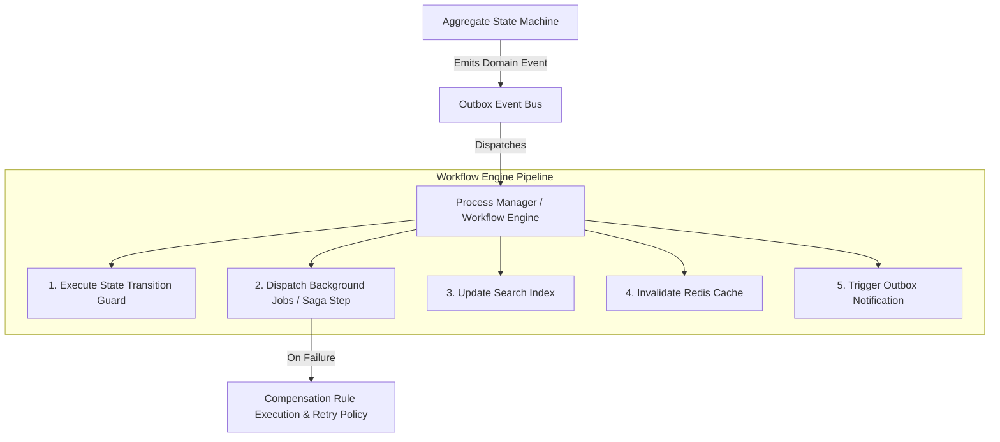

# ADR-013: Workflow & Process Orchestration Architecture

* **Status**: Accepted
* **Deciders**: Quran Competition Platform Architecture Board
* **Date**: 2026-07-31

---

## Context & Problem Statement

The Quran Competition Platform manages multi-step, event-driven domain lifecycles:
1. **Application Lifecycle**: `draft` → `submitted` → `video_transcoding` → `under_review` → `ready_for_judging` → `qualified`/`eliminated` → `results_published`.
2. **Video Processing Pipeline**: `raw_uploaded` → `ffmpeg_queued` → `variant_generation` → `hls_playlist_creation` → `waveform_extracted` → `ready`.
3. **Judging & Scoring Quorum**: `evaluation_started` → `5_judge_quorum` → `AllJudgesCompleted` → `RankingService` → `2_step_admin_publishing`.
4. **Appeals & Remediation**: `appeal_submitted` → `appeal_under_review` → `accepted`/`rejected` → `score_recalculation`.

Directly orchestrating these cross-module transitions inside individual Aggregate Roots violates Single Responsibility, creates tight coupling, and lacks unified retry/compensation mechanisms when async background jobs (such as FFmpeg transcoding or Mail dispatches) fail.

---

## Decision Drivers

* **Process Isolation**: Aggregate Roots must encapsulate business state transitions via State Machines, but process orchestration (triggering notifications, clearing cache, updating search indexes, executing background queues) must be managed by a unified `WorkflowEngine`.
* **Saga Pattern & Compensation Rules**: Complex multi-step operations (e.g. video transcoding failure triggering an automated `ApplicationNeedsData` state transition with notification dispatch) require explicit compensating actions.
* **Deterministic Execution & Observability**: Every workflow step execution, retry attempt, and manual intervention must be logged for auditability.

---

## Technical Architecture & Design



### 1. Unified `WorkflowEngine` Interface

```php
namespace App\Services\Workflow;

interface WorkflowEngineContract
{
    /**
     * Dispatch a state transition workflow across domain aggregates and technical services.
     */
    public function execute(WorkflowContext $context): WorkflowResult;
}
```

### 2. Process Managers & Saga Compensation Policies

Each complex cross-module lifecycle is governed by a dedicated **Process Manager**:
- `ApplicationSubmissionWorkflow`: Coordinates video transcoding trigger, notification queueing, and search document indexing.
- `EvaluationCompletionWorkflow`: Listens for `AllJudgesCompleted`, invokes pure `RankingService`, constructs `StageResult`, and notifies Head Judge.
- `VideoTranscodingWorkflow`: Governs FFmpeg processing, variant generation, and compensating rollback (`ApplicationNeedsData` transition if transcoding fails after 3 retries).

---

## Consequences & Benefits

* **Zero God Objects**: Keeps Aggregates and Rule Engines lean and focused purely on business invariants.
* **Resilient Failure Recovery**: Automated retry policies (exponential backoff up to 3 attempts) and Saga compensation rules prevent orphan states.
* **Unified Pipeline**: Ensures every state change automatically synchronizes Search, Cache, Notifications, and CDN purges in a unified order.

---

## Related ADRs

* [ADR-001: System Architecture](../../docs/adr/ADR-001-system-architecture.md)
* [ADR-006: Video Transcoding Architecture](../../docs/adr/ADR-006-video-transcoding-architecture.md)
* [ADR-008: Eventing & Domain Events Governance](../../docs/adr/ADR-008-eventing-domain-events.md)
* [ADR-012: Application Layer Architecture](../../docs/adr/ADR-012-application-layer-usecase-orchestration.md)
