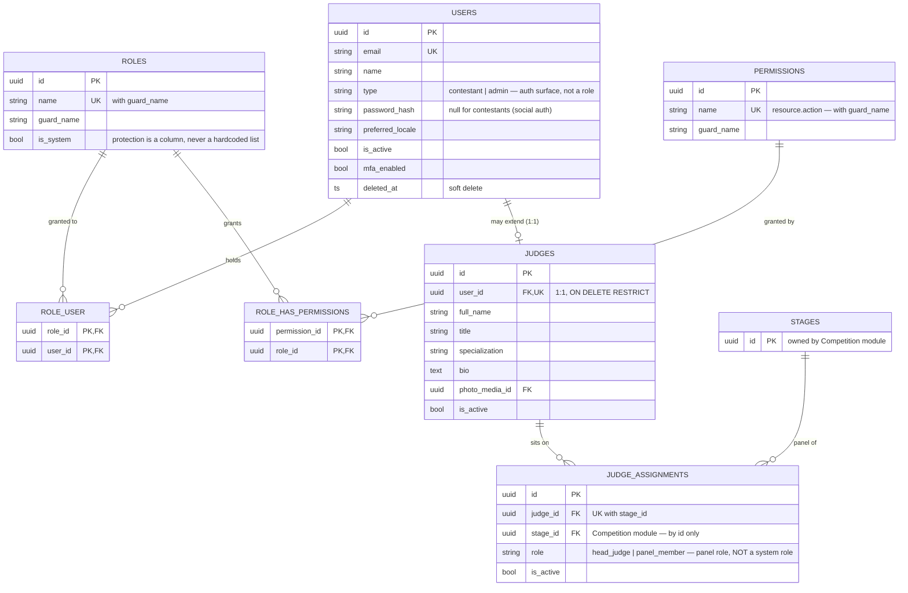

# ADR-015: Identity and Access Architecture

* **Status**: ✅ **Accepted — 2026-08-17.** All five open questions settled. This document is the single reference for the Identity & Access implementation; changes to it require an amendment, not a decision at the keyboard.
* **Deciders**: Quran Competition Platform Architecture Board
* **Date**: 2026-08-17
* **Supersedes**: nothing. **Complements**: ADR-003 (which decided *authentication* and explicitly left *authorization* undefined)

---

## Context & Problem Statement

ADR-003 decided how an account proves who it is. It never decided what an account is *allowed to do*. It refers to "a Super Administrator with `users.create` permission" without defining what a permission is, where it is stored, or who may grant one. ADR-001 lists the intended actors — Super Administrators, Competition Managers, Judges, Evaluators, Data Entry operators, Moderators — and no ADR since has said how those become real.

The result is a gap that the code has been filling with placeholders. Before writing any of this epic, the actual starting point must be stated plainly, because it is not what the schema suggests.

### What exists today (verified against the code, not assumed)

| Artifact | Reality |
|---|---|
| `roles`, `permissions`, `role_user`, `role_has_permissions` tables | Exist, created by this project's own migrations (`Modules/Core/Database/Migrations/2026_01_01_00000{2,3,4,5}`). All four are **empty of behaviour** — no application code reads or writes any of them. |
| `spatie/laravel-permission` v8.3 | In `composer.json`, `config/permission.php` published. **Zero application code uses it.** No `HasRoles` trait, no `permission:` middleware, no Spatie model referenced anywhere in `Modules/` or `app/`. |
| `Modules\Core\Domain\Entities\Role` | Exists, has `guardName` and `grantPermission()`. **Zero references** anywhere in the codebase. |
| Authorization enforcement | Exactly one binary check, in `EnsureUserIsAdmin`: `$user->type !== 'admin'` → 403. Nothing finer-grained exists. |
| `roles` / `permissions` in the API response | **Fabricated in the Resource.** `UserResource` returns `'roles' => [$user->getType()]` and `'permissions' => $type === 'admin' ? ['*'] : []`. The admin panel is being told every admin holds `*`. |

Two consequences follow, and they shape every decision below.

**First**, there is no RBAC to migrate away from. This is a greenfield authorization design sitting on top of four empty tables. That is a freedom, and it means the cost of choosing correctly now is low.

**Second**, the existing tables are a *half-Spatie hybrid that is compatible with neither*. `role_has_permissions` matches Spatie's expected name; `role_user` does not (Spatie expects the polymorphic `model_has_roles`); `model_has_permissions` — which Spatie requires for direct user permissions — does not exist at all. Adopting Spatie is therefore **not** a zero-migration decision, and anyone who assumes it is will discover this halfway through.

### The `permissions: ['*']` lie is the most urgent item here

It is not cosmetic. The admin panel currently receives a permission list that is not derived from anything, for a user whose real capability is "passed a boolean `type` check". Every frontend feature that branches on `permissions` is branching on a constant. This is the same defect class the Shaabjo review rejected — *computing domain facts in a Resource* — and it exists in our own code today, not just theirs.

---

## Decision Drivers

* **The domain must not learn Eloquent.** ADR-002 and ADR-012 put persistence behind contracts; an authorization model is not an exception.
* **Nothing gets built that does not change system behaviour.** The project's own standing rule, and the reason `PermissionGroup` was rejected from Shaabjo.
* **A role created in the panel must actually work.** Shaabjo's central failure: a role with all 150 permissions still could not log into the admin panel, because admin-ness was a hardcoded list in five files.
* **No source of truth may be duplicated.** Shaabjo carried two grouping mechanisms and a role list with different contents in different files.
* **Privilege escalation must be structurally impossible**, not merely unimplemented.

---

## Decision

### 1. The vocabulary

Each term below is defined by *what decision it changes*. A term that changes no decision is not in this design.

#### User

The account. One row in `users`, identified by `UserId`, holding credentials (`email`, `password_hash`), presentation preference (`preferred_locale`), lifecycle state (`is_active`, soft delete), and MFA state. It is the only thing that authenticates.

A User is **not** a person's role, job, or profile. Those attach to it.

#### `users.type` — the authentication surface, not a role

`type` has exactly two values: **`contestant`** or **`admin`**. It answers one question and no other:

> **Which authentication surface may this account use?**

> **DECIDED 2026-08-17 — the rename happens.** The column currently stores `'user'` for contestants. Once admin accounts are first-class, "user" as a value on the `users` table is ambiguous to the point of being misleading. `'user'` is renamed to `'contestant'` and **no place in the codebase may use `"user"` to mean a contestant** thereafter. This lands in epic 1 (which already touches `EnsureUserIsAdmin`, the seeders and the affected tests) as a data migration plus a sweep of the string literal. An architecture test asserts `type` only ever holds one of the two values.

Contestants authenticate via social providers on the public surface. Admins authenticate via email/password + MFA on the admin surface. That is an ADR-003 decision and this ADR does not reopen it.

**This is the deliberate fix for Shaabjo's `ADMIN_ROLES` defect.** There, "can this account reach the admin panel?" was answered by testing a role name against a hardcoded array copied into five files, so a fully-permissioned role created from the UI still could not log in, and there was no column to fix it with. Here the question is answered by a column that already exists and is already indexed. Admin-ness is data. **No role name may ever be hardcoded anywhere in this codebase for any purpose.**

The division of labour is therefore:

* `users.type` → *may you enter this door?*
* roles/permissions → *what may you do once inside?*

#### Admin

**Not an entity.** An Admin is a User with `type = 'admin'`. There is no `admins` table, no Admin aggregate, no Admin model. The word describes a User, it does not name a thing.

What distinguishes one admin from another is the roles they hold — a Competition Manager and a Data Entry operator are both `type = 'admin'`, differing only in roles. ADR-001's six actor names are **role names, not types**.

#### Judge

**An entity, and the schema already decided this.** `judges.user_id` is `UNIQUE` with `onDelete('RESTRICT')` — a one-to-one that refuses to let a User be deleted while a Judge hangs off it. The table carries `full_name`, `title`, `specialization`, `bio`, `photo_media_id`, `is_active`.

The justification is that none of those columns belong on a Role. "Specialization: تجويد" is not a permission and cannot be expressed as one. A Judge is a *professional profile with domain data*, which is a different kind of thing from a grant of capability.

A Judge is therefore: **a User (`type = 'admin'`) + a `judges` row + normally the `judge` role.** Three separate facts, each independently true or false, and the system must tolerate all combinations rather than inferring one from another:

* A User with the `judge` role but no `judges` row → a misconfiguration the system should surface, not crash on.
* A `judges` row whose User is deactivated → a judge on leave; assignments persist, login does not.

#### Role

A named, admin-editable bundle of permissions. `roles(id, name, guard_name, is_system, created_at, updated_at)` — plus `is_system`, added by this ADR (§6).

Roles are **data, not code**. The expected initial set — `super_admin`, `competition_manager`, `judge`, `evaluator`, `data_entry`, `moderator` — ships as a **seeder**, not as constants, not as an enum, not as a match expression. Every one of them is editable and deletable from the panel except as §6 restricts.

#### Permission

The atomic capability, named `resource.action` — `seasons.create`, `applications.review`, `users.create`. This convention is taken from Shaabjo, where it was applied consistently across ~150 permissions and worked.

Permissions are **code, not data**, in the sense that matters: they are seeded from a definitive list maintained alongside the code that checks them, because a permission with no `Gate` check behind it is a checkbox that lies. The rule is:

> A permission may only exist in the seeder if some code path actually checks it.

Adding a permission row that nothing enforces reproduces, in a different shape, exactly the "UI claims a fact that isn't true" failure this design is built to avoid.

#### Permission Group

**Not an entity. No table. No `permission_group_id`. No CRUD.**

Grouping is real and needed — 150 checkboxes require visual organisation — but it is **derived from the name**, not stored. `seasons.create`, `seasons.update`, `seasons.archive` group under `seasons` because their names say so. The group is `explode('.', $name)[0]`.

This is a direct correction of Shaabjo's dead-end, and the reasoning is worth recording because it generalises. There, `PermissionGroup` was a full entity with CRUD, but `permission_group_id` was written **only by the seeder** — no endpoint ever set it. So a group created from the panel could never be populated: a feature that appeared to work, could not, and nothing in the type system said so. It was also duplicated, with a legacy `permissions.group` string column added a day before the FK and never dropped, leaving two grouping mechanisms that could disagree.

Deriving the group from the name cannot drift, cannot be empty, needs no write path, and needs no migration. The label shown to the admin (`"إدارة المواسم"` for `seasons`) is an i18n key in the admin's `permissions` namespace — presentation, where it belongs.

#### Department — **deferred, not approved**

The proposal is organisational only (الإدارة العليا، إدارة المسابقة، إدارة التسجيل، إدارة الحكام، إدارة الإعلام، إدارة البث), explicitly with no effect on permissions.

**This ADR does not approve it**, on the project's own rule: *nothing gets built that does not change system behaviour*. That rule is precisely why `PermissionGroup` was rejected, and a Department that only labels users is the same shape of thing.

It is not rejected outright, because it differs from `PermissionGroup` in one respect that could rescue it: `PermissionGroup` died for lack of a write path, while a Department has an obvious one (`users.department_id`).

**The test it must pass before it is built** — one concrete decision the system makes differently because a Department exists:

* *Filtering a user list by department* → does not qualify. That is a saved search.
* *Routing work* — "registration-desk applications go to إدارة التسجيل", "this notification goes to whoever staffs إدارة الحكام" → qualifies. That is behaviour, and nothing else in this design answers it.

Until someone names a rule of the second kind, `users.department_id` is not added. **Revisit when the notification-routing or work-queue epic is specified**, since that is where the qualifying rule would come from if it exists.

#### Judge Assignment

A Judge's membership of one Stage's panel. `judge_assignments(id, judge_id, stage_id, role, is_active)` with `unique(judge_id, stage_id)`.

Its `role` column (`head_judge` / `panel_member`) is **a role within a panel and has nothing to do with system roles.** They are deliberately separate concepts that unfortunately share a word: a `head_judge` on one stage's panel may be a `panel_member` on another's, and neither fact grants any system permission. The permission to *score at all* comes from the `judge` system role; *which* applications one may score comes from assignment. This ADR keeps them in separate tables with no FK between them, and the naming collision should be treated as a known hazard in code review.

---

### 2. Relationships

```
                 ┌───────────────────────────────────────────┐
                 │                  User                     │
                 │  type: contestant | admin  (auth surface)  │
                 └───────────────────────────────────────────┘
                        │                        │
          role_user     │                        │ 1:1 (judges.user_id UNIQUE)
          (M:N)         │                        │ RESTRICT
                        ▼                        ▼
                 ┌─────────────┐          ┌─────────────┐
                 │    Role     │          │    Judge    │
                 │  is_system  │          │ specialization
                 └─────────────┘          └─────────────┘
                        │                        │
   role_has_permissions │                        │ 1:N
          (M:N)         │                        │ unique(judge_id, stage_id)
                        ▼                        ▼
                 ┌─────────────┐          ┌──────────────────┐
                 │ Permission  │          │ JudgeAssignment  │
                 │resource.act │          │ role: head|member│
                 └─────────────┘          └──────────────────┘
                                                   │
                                                   │ stage_id (by id only —
                                                   ▼  Competition module)
                                             ╌╌╌╌╌╌╌╌╌╌╌╌
                                                 Stage
```

Notes that matter:

* **Permissions attach to Roles only, never directly to Users.** A per-user exception is invisible in the roles UI, unauditable at a glance, and is how permission sprawl starts. If a user needs a capability, either their role grants it or a role exists that does.
  With the custom RBAC decided (§4), this is **structural, not policy**: no `model_has_permissions` table exists, so a `User → Permission` edge cannot be created even by mistake. Retaining that guarantee was one of the board's stated reasons for the decision — Spatie would have forced the table to exist (its `HasRoles` pulls in `HasPermissions`, which queries it on every check), degrading the rule to a convention. See [RBAC-IMPLEMENTATION-COMPARISON.md](../RBAC-IMPLEMENTATION-COMPARISON.md) §3.2.
* `judge_assignments.stage_id` references a Competition-module table. Per ADR-002 this crosses a module boundary, so it is referenced **by id only** — the Judges module never imports a Stage entity, and panel composition is read through a contract.

---

### 3. Aggregates and their boundaries

| Aggregate Root | Contains | Enforces | Module |
|---|---|---|---|
| **User** | identity, credentials, MFA state, `type`, `is_active`, the *set of role ids* it holds | valid email; a role cannot be assigned twice; cannot deactivate the last active `super_admin` holder | Core |
| **Role** | name, `is_system`, the *set of permission ids* it grants | name unique per guard; a system role's name and `is_system` are immutable; `super_admin`'s permission set is immutable | Core |
| **Permission** | name, guard | **reference data.** Not admin-writable. Seeded, read-only through the API. | Core |
| **Judge** | profile columns, `is_active` | must reference an existing User; deactivating cascades to no assignments (see below) | Judges |
| **JudgeAssignment** | judge id, stage id, panel role, `is_active` | one assignment per (judge, stage) | Judges |

**Why `JudgeAssignment` is its own root and not part of `Judge`:** its invariant — one assignment per judge per stage — is scoped to the *(judge, stage)* pair, and stage lives in another module. Loading a full Judge aggregate to add one panel membership would mean the Judges module reaching into Competition to validate, which ADR-002 forbids. Keeping it separate lets the assignment use case validate the stage through the Competition contract and keeps the Judge aggregate about the *person*.

**Why User holds role ids and not Role objects:** the User aggregate must be loadable and savable without loading every permission of every role. It holds ids; permission resolution is a read-model concern (§5).

#### 3.1 ER diagram



Two things the diagram is meant to make unmissable:

* **There is no edge from `USERS` to `PERMISSIONS`.** The only path is through `ROLES`. No `model_has_permissions` table exists, so the edge cannot be drawn even by accident.
* **`JUDGE_ASSIGNMENTS.role` does not connect to `ROLES`.** Same word, unrelated concept (§1).

---

### 4. The mechanism: a custom RBAC — **DECIDED**

> **Question 1 is settled: Option B, a custom RBAC. `spatie/laravel-permission` is removed from `composer.json`.**
> Decided by the board 2026-08-17 on the evidence in [RBAC-IMPLEMENTATION-COMPARISON.md](../RBAC-IMPLEMENTATION-COMPARISON.md).
> **This decision is binding and is not reopened during implementation.**

The board's reasoning, recorded because it is the reason the shape below is correct rather than merely workable:

* **UUID first.** The platform is UUID throughout (ADR-005 D2); Spatie is integer-first and needs bespoke configuration to be otherwise.
* **`User → Role → Permission`, and never `User → Permission`.** Direct grants are a first-class part of Spatie's design and are a defect in ours.
* **Judge is an extension of User, not a Role** — which composes naturally with an RBAC we own.
* **Audit is part of the design**, not an attempt to intercept a package's events.
* **One system, admin-only.** Not a SaaS with thousands of roles and tenants, which is the scale Spatie's complexity is for.

This decision must not be read as licence to write RBAC quickly. The rest of this section fixes the shape *before* implementation, so no design decision is taken at a keyboard.

#### 4.1 Layering

```
Domain            Modules/Core/Domain/            — pure PHP. No Eloquent, no framework.
  ├─ Entities/User.php                 holds roleIds; assignRole(), revokeRole()
  ├─ Entities/Role.php                 AGGREGATE ROOT — holds permissionNames;
  │                                    grant(), revoke(), rename(), isSystem()
  ├─ ValueObjects/PermissionName.php   validates and parses `resource.action`
  ├─ ValueObjects/RoleId.php
  └─ Exceptions/                       SystemRoleImmutableException,
                                       PrivilegeEscalationException,
                                       LastSuperAdminException

Contracts         Modules/Core/Domain/Repositories/
  ├─ RoleRepositoryContract            find, findByName, all, save, delete, existsWithName
  └─ UserRepositoryContract            find, findByEmail, save, delete, countUsersWithRole
                                       (the User aggregate carries its own role ids;
                                        no separate UserRoleRepositoryContract was needed)

  PermissionCatalog is NOT behind a contract. It is a static Infrastructure
  class, because the domain may not import Infrastructure and has no reason
  to read it: membership is checked at the use-case boundary instead.

Application       Modules/Core/Application/UseCases/
  └─ the only place RBAC is written. Every write emits a domain event
     and an audit entry in the same transaction.

Infrastructure    Modules/Core/Infrastructure/
  ├─ Database/Repositories/RoleRepository.php        Eloquent, confined here
  ├─ Database/Repositories/UserRoleRepository.php
  ├─ Permissions/PermissionCatalog.php               the static catalogue (§4.3)
  └─ Permissions/EffectivePermissionResolver.php     resolution + cache (§4.6)

Presentation      Gate/policies only. Controllers never read a pivot.
```

The rule that survives from the original draft, unchanged and unconditional: **no `Modules/*/Domain/` file imports Eloquent or any package.** `RoleRepository` maps rows to the domain `Role` exactly as `SeasonRepository` already maps rows to `Season`.

#### 4.2 The four tables — final shape

No table renames. No polymorphic columns. No `model_has_permissions`.

| Table | Columns | Change from today |
|---|---|---|
| `permissions` | `id` uuid, `name`, `guard_name`, unique(name, guard_name), timestamps | **none** |
| `roles` | `id` uuid, `name`, `guard_name`, **`is_system` bool default false**, unique(name, guard_name), timestamps | **add `is_system`** |
| `role_has_permissions` | `permission_id` uuid, `role_id` uuid, primary(permission_id, role_id), FK CASCADE both | **none** |
| `role_user` | `role_id` uuid, `user_id` uuid, primary(role_id, user_id), FK CASCADE both | **none** |
| `model_has_permissions` | — | **never created.** `User → Permission` is structurally impossible, not merely discouraged |

**One added column is the entire schema cost of this epic.** That is the practical payoff of the decision.

`guard_name` is retained (it costs nothing, the unique indexes already include it, and it leaves the door open if a second guard is ever needed). It is `'web'` everywhere for now and no code branches on it.

> **AMENDED 2026-08-18 — eight permissions were added after acceptance, each for a route that had nowhere to attach.** Four when the admin routes were mapped for enforcement (`streaming.start`, `streaming.stop`, `videos.reprocess`, `lookups.view`) and four for the identity surfaces (`roles.grant_permissions`, `users.assign_roles`, `users.activate`, `users.deactivate`). The catalogue stands at **85** across 24 resources, and `ALLOWED_VERBS` at **27**.
>
> The last four are the same decision made four times, and it is the decision this ADR removed the `manage` verb for: **editing what something is called is not editing what it can do.** `roles.update` renames a role; `roles.grant_permissions` changes the capability it confers — the escalation surface PE-2 guards. `users.update` edits an account; `users.assign_roles` hands it authority — the surface PE-1 guards. Activation is separated from both, and from itself: granting access back and cutting it off are different decisions, and the one that can strand the platform is the one worth granting deliberately. Each is proved independent in both directions by tests, because a single direction still passes if one permission is accidentally a superset of the other.

#### 4.3 `Permission` is a catalogue, not a CRUD resource

Permissions are **code that happens to be persisted**, not admin-managed data. The definitive list lives in one PHP file next to the checks that enforce it:

```
Modules/Core/Infrastructure/Permissions/PermissionCatalog.php
```

* The seeder reads the catalogue and upserts `permissions` rows. Never the reverse.
* The API exposes permissions **read-only** — `GET /admin/permissions`. There is no create, update or delete endpoint, and no use case for one.
* **AMENDED 2026-08-18: the response is a flat list of names, not grouped.** A permission group is a way of reading `resource.action`, not a thing this system has, so the client derives it. Sending groups would mean a new resource needs a server change to become visible, and a translated group heading would need a home in the database — the dead end Shaabjo's `permission_group` table became. A test pins the payload to exactly one key so grouping cannot creep back in silently.
* **The binding rule, restated from §1 because it is the one that keeps the catalogue honest:** a permission may exist in the catalogue only if some code path actually checks it. A row nothing enforces is a checkbox that lies to the administrator.
* An **architecture test** asserts every catalogue entry is referenced by at least one `Gate`/policy check, and that every string passed to `authorize()`/`can()` exists in the catalogue. This is what stops the two from drifting — the failure mode that produced Shaabjo's two competing grouping mechanisms.

#### 4.4 Permission naming convention

```
resource.action
```

* **`resource`** — plural, snake_case, matching the API resource segment: `seasons`, `applications`, `judge_assignments`, `users`, `roles`.
* **`action`** — a verb from a fixed, closed set. New verbs require an ADR amendment, because an open verb set is how 150 permissions become 400 inconsistent ones.

| Verb | Meaning |
|---|---|
| `view` | read a list or a single record |
| `create` | bring into existence |
| `update` | modify an existing record |
| `delete` | remove (soft or hard, per ADR-005's delete policy) |
| `archive` | the Season-style archive-only lifecycle transition |
| `restore` | undo an archive |
| `review` | decide on a submission (applications) |
| `publish` | make results or content publicly visible |
| `assign` | attach an actor to something (judges to panels, roles to users) |
| `export` | produce a downloadable artefact |

> **AMENDED 2026-08-20 — two verbs added for membership lifecycle: `end` and `transfer`.** Epic 2 Story 3 introduced `contestant_memberships`, and the architecture test refused both names before any of the code shipped — which is the verb set working as designed rather than an obstacle to route around.
>
> **`end`** was added rather than reusing an existing verb because every candidate asserts something ADR-016 Q4 decided is false. Q4 made membership *historical*: a membership finishes by acquiring `left_at`, and the row stays because applications freeze circle names (D8) against periods that must remain readable. `delete` would tell every reader the row is gone; `cancel` would say the membership should never have happened, which is a data-entry correction and a different act; `archive` and `deactivate` both say hidden or suspended. The distinction is not cosmetic — the route is a `POST .../end` rather than a `DELETE` for the same reason, and a verb contradicting that would be the one place the vocabulary lied about the schema.
>
> **`transfer`** was added rather than composing `create` + `end` because a transfer is a single act with its own trust boundary. An operator trusted to enrol a newcomer is not thereby trusted to move a contestant out of another supervisor's circle, and the two halves cannot be granted separately if the act is expressed as both. It also has a consequence neither half has: the pair is emitted as one `ContestantTransferred` event precisely because an ending followed by a beginning is indistinguishable from a departure and an unrelated later enrolment.
>
> Neither verb weakens §4.4's rule. Both are atomic, both name one thing, and neither is a composite in the sense the `manage` verb was removed for. `ALLOWED_VERBS` stands at **34**, and the catalogue at **97** across 27 resources.

> **DECIDED 2026-08-17 — there is no `manage` verb.** An earlier draft admitted one as "reserved and discouraged"; the board removed it outright. The initial catalogue is **atomic only**: `users.view`, `users.create`, `users.update`, `users.delete`, `users.restore` — never `users.manage`. A coarse verb is a permission that cannot be reasoned about: it is unclear what it grants, it cannot be revoked partially, and it quietly becomes the default because it is easier to grant than to think. If a genuine need for a composite verb appears later it can be added by amending this ADR — but it does not exist on day one, when the temptation to reach for it is highest and the justification weakest.

* **The group is `explode('.', $name)[0]`.** Nothing stores it (§1). Group display labels are i18n keys in the admin's `permissions` namespace.
* Names are **immutable once shipped**. Renaming a permission silently strips capability from every role holding it; a rename is a new permission plus a data migration, never an `UPDATE`.
* No wildcards. `*` is not a permission and cannot be granted (§5).

#### 4.5 Domain events

Every RBAC write emits one, from the use case, inside the transaction — per ADR-008 and ADR-012.

| Event | Payload | Emitted by |
|---|---|---|
| `RoleCreated` | roleId, name | CreateRoleUseCase |
| `RoleRenamed` | roleId, oldName, newName | RenameRoleUseCase |
| `RoleDeleted` | roleId, name | DeleteRoleUseCase |
| `RolePermissionsChanged` | roleId, added[], removed[] | SyncRolePermissionsUseCase |
| `UserRolesChanged` | userId, added[], removed[] | SyncUserRolesUseCase |
| `AdminUserCreated` | userId, email, roleIds | CreateAdminUserUseCase |
| `UserDeactivated` / `UserReactivated` | userId, byUserId | the corresponding use cases |

`RolePermissionsChanged` and `UserRolesChanged` carry **deltas, not final state**, because "what changed" is the question an auditor asks and reconstructing it from snapshots is lossy.

#### 4.6 Caching — the one part with real risk

The comparison brief was explicit that this is the cost of choosing custom, and that a mistake here is a security bug rather than a performance one. So it is specified, not left to implementation.

**Shape**

* One cache key per user: `rbac:user:{userId}:permissions` → a flat `string[]` of effective permission names.
* Resolution on miss is a single query: `role_user ⋈ role_has_permissions ⋈ permissions WHERE role_user.user_id = ?`.
* TTL is a backstop (24h), not the correctness mechanism. **Invalidation is.**

**Invalidation — exhaustive by construction**

The writers are enumerable precisely *because* §2 forbids direct user permissions. There are exactly four ways a user's effective set can change:

| Write | Invalidate |
|---|---|
| user's roles change | that user's key |
| a role's permissions change | every user holding that role |
| a role is deleted | every user who held it (resolved **before** the delete) |
| a user is created with roles | nothing — no key exists yet |

Each is a use case, and each calls the invalidator explicitly. **Nothing else in the system may write these tables**, which is what makes the list complete.

**Guards against the failure mode**

* A feature test asserting that after `SyncRolePermissionsUseCase`, an affected user's **next request** reflects the change — the exact stale-authorization bug this design is most exposed to.
* A test asserting cache invalidation on role deletion resolves holders *before* the rows are gone.
* `Cache::flush()` is never used for this; only the specific keys are forgotten.

#### 4.7 Audit

Per PE-7 and unchanged by this decision: logged **explicitly from the use case**, never from a model observer, recording causer, subject, and added/removed sets. `spatie/laravel-activitylog` stays (it is unrelated to `laravel-permission` and is already used elsewhere).

The reason this is now structural rather than a workaround: the domain events in §4.5 already carry exactly the delta an audit entry needs, so the audit listener consumes them rather than re-deriving anything.

---

### 5. The `permissions: ['*']` fix

`UserResource` stops computing anything. It reports what the aggregate holds:

```
'roles'       => the user's role names, from the aggregate
'permissions' => the effective permission names, resolved through the
                 permission read-model (cached), never a literal
```

A super admin's response then contains the real names rather than `['*']` — **85 as of 2026-08-18**, not the ~150 estimated when this was written. If the frontend wants a shorthand, it derives one; the API does not invent one.

**Wildcards are not introduced.** `*` is not a permission and cannot be granted. `super_admin` is powerful because it holds every permission, not because it holds a magic one — which means the admin UI can show exactly what it can do, and an audit log can record exactly what changed.

---

### 6. Privilege escalation rules

These are invariants, enforced in the domain and the use case layer, not merely absent from the UI.

**PE-1 — You cannot grant what you do not hold.**
A user may only assign a role whose permission set is a **subset** of their own effective permissions. Prevents a Data Entry operator with `users.update` from assigning themselves `super_admin`.

**PE-2 — You cannot edit a role into something you could not grant.**
Editing a role's permissions is restricted to permissions the editor holds. Otherwise PE-1 is trivially bypassed by editing a role you *can* assign.

**PE-3 — You cannot change your own roles.** Self-assignment is refused regardless of permissions held. Role changes for an account are made by a different account.

**PE-4 — System roles are protected by a column, never by a list.**
`roles.is_system` is a real boolean column. `super_admin` is seeded with `is_system = true` and: cannot be renamed, cannot be deleted, cannot have permissions revoked.

> This column exists specifically because of Shaabjo's failure mode, where `is_system` was *computed in a Resource from a hardcoded list* — so the UI displayed a protection badge on eight roles while exactly one was actually protected. A badge that does not correspond to enforcement is worse than no badge. Here the badge reads the same column the guard reads.

**PE-5 — The last active holder of a **system role** cannot lose it.**
Neither by revoking the role, nor deactivating the account, nor soft-deleting it. Refused with a distinct error, not a generic 403. Guards against locking the organisation out of its own platform.

> **AMENDED 2026-08-18 — generalised from `super_admin` to `roles.is_system`.** The first implementation looked the role up by name and the epic-3 architecture guard rejected it: a hardcoded role name is exactly what PE-4 made a column to avoid, and a second system role added later would have fallen silently outside the protection. The exception is `LastSystemRoleHolderException`. The count deliberately includes only **active, non-deleted** accounts — PE-5 exists so someone can always administer the platform, and a deactivated holder does not provide that.
>
> Both halves are enforced: `SyncUserRolesUseCase` for revocation, `DeactivateUserUseCase` for deactivation. Deletion has no endpoint yet, so that third door is closed by absence rather than by a guard.

**PE-6 — You cannot deactivate or delete yourself.** Same reasoning, cheaper to enforce.

**PE-7 — Every RBAC change is explicitly audited.**

This is the Shaabjo insight worth transferring wholesale, and it is subtle enough to be worth restating: **Eloquent model observers never fire for role and permission changes, because those changes are writes to pivot tables (`role_user`, `role_has_permissions`), not to model attributes.** Any audit system relying on model observers records nothing at all and appears to work.

Historically this bit Shaabjo because `spatie/laravel-permission` ships its own pivot events (`RoleAttachedEvent`, …) but defaults `'events_enabled' => false` — so their audit recorded nothing while appearing to work. With the custom RBAC now decided (§4), that trap does not exist here at all: the writes are our own use cases, and §4.5's domain events carry the delta by construction.

RBAC mutations are logged explicitly, from the use case, recording causer, subject, and added/removed sets. `spatie/laravel-activitylog` remains the mechanism (unrelated package, already used elsewhere), consumed from the §4.5 events, never from a model observer.

---

### 7. Lifecycles

#### Creating a contestant

Self-service, per ADR-003. Social provider → `users` row with `type = 'contestant'`, no roles, no password. Authorization on the public surface is ownership-based ("your own application"), not role-based.

#### Creating an admin

No self-registration (ADR-003). A user holding `users.create`:

1. `CreateAdminUserUseCase` — email, name, `type = 'admin'`, `is_active = true`, no password.
2. Roles assigned in the same transaction, **subject to PE-1**.
3. An invitation/set-password flow issues the credential; the creator never sets another user's password and never sees it.
4. MFA enrolment on first login, per the existing TOTP flow.
5. `AdminUserCreated` + explicit RBAC audit entry (PE-7).

#### Creating a judge

Three facts, one transaction, in this order — because each depends on the previous:

1. **User** — `type = 'admin'` (judges use the admin authentication surface).
2. **`judge` role assigned** — grants *the capability to score*.
3. **`judges` row** — the profile: specialization, title, bio, photo.

Then, separately and repeatedly over the season: **JudgeAssignment** per stage, granting *the scope* — which panel, and whether head or member.

The separation is the point. Step 2 says "may score". Step 4 says "may score *this*". Removing a judge from a panel does not strip their capability or delete their profile; deactivating their User stops their login while assignments and history remain intact, because `RESTRICT` on `judges.user_id` means historical evaluations never lose their author.

#### 7.1 User lifecycle

```
                    ┌──────────────────────────────────────────┐
                    │  (does not exist)                        │
                    └──────────────────────────────────────────┘
                       │ contestant: social sign-in (self-service)
                       │ admin: CreateAdminUserUseCase by users.create holder
                       ▼
                ┌─────────────┐   invite accepted / password set
                │  invited    │──────────────────────────────┐   (admins only)
                │ (no cred.)  │                              │
                └─────────────┘                              ▼
                                                     ┌───────────────┐
                    roles synced (PE-1, PE-3) ◄──────│    active     │──────► MFA enrolled
                                                     │ is_active=1   │
                                                     └───────────────┘
                                                        │        ▲
                              DeactivateUserUseCase     │        │  ReactivateUserUseCase
                              (PE-5, PE-6)              ▼        │
                                                     ┌───────────────┐
                                                     │  deactivated  │  login refused,
                                                     │ is_active=0   │  roles & history kept
                                                     └───────────────┘
                                                        │
                              soft delete (PE-5, PE-6)  │  RESTRICT if a judges row exists
                                                        ▼
                                                     ┌───────────────┐
                                                     │   deleted     │  deleted_at set;
                                                     │  (soft only)  │  never hard-deleted
                                                     └───────────────┘
```

Rules the diagram encodes:

* **Deactivation is the reversible instrument; deletion is not the tool for "this person left."** Deactivating preserves roles, judge profile, assignments and authorship of past evaluations.
* Neither transition may be applied to **yourself** (PE-6) or to the **last `super_admin`** (PE-5).
* Soft delete only, per ADR-005's delete policy. A User with a `judges` row cannot be hard-deleted at all — `RESTRICT` protects evaluation history.
* Role changes are available in `active` and `deactivated` alike; they are orthogonal to lifecycle state.

#### 7.2 Role lifecycle

```
   CreateRoleUseCase              SyncRolePermissionsUseCase (PE-2)
   (name unique per guard)        RenameRoleUseCase
          │                              │
          ▼                              ▼
   ┌──────────────┐   ◄──────────────────┘        ┌──────────────────────┐
   │   custom     │                               │       system         │
   │ is_system=0  │                               │    is_system=1       │
   │              │                               │  seeded only         │
   │ • renamable  │                               │ • NOT renamable      │
   │ • editable   │                               │ • NOT deletable      │
   │ • deletable  │                               │ • permissions frozen │
   └──────────────┘                               └──────────────────────┘
          │                                                  │
          │ DeleteRoleUseCase                                │ (no transition exists —
          │  · refused if is_system                          │  is_system is set by the
          │  · holders resolved BEFORE delete (cache §4.6)   │  seeder and never by an API)
          ▼                                                  ✗
   ┌──────────────┐
   │   deleted    │  role_user and role_has_permissions rows CASCADE away;
   │  (hard)      │  affected users' permission caches invalidated
   └──────────────┘
```

Rules:

* **`is_system` is set by the seeder and by nothing else.** No endpoint can promote a custom role to a system role or demote one — otherwise PE-4 is bypassable through the very UI it protects.
* Roles are **hard-deleted**, not soft-deleted: a lingering soft-deleted role whose pivots still exist is an authorization hazard, and there is no audit value in the row itself once the deletion event records its name and permission set.
* Deleting a role is permitted **even while users hold it** — the CASCADE removes the grants — but the use case must resolve the holders *before* deleting so their caches can be invalidated (§4.6). It is an ordinary, auditable operation, not an error.
* `super_admin` is seeded `is_system = true` and additionally cannot have permissions revoked (PE-4), which is what makes PE-5 meaningful.

---

### 7.3 Capability matrix — who holds what

This is the **accepted seed** (decision 4). It is data, not code: every row below is editable in the panel after seeding, except where `is_system` forbids it.

Legend: ● full · ◐ partial (see notes) · — none

| Permission group | `super_admin` | `competition_manager` | `judge` | `evaluator` | `data_entry` | `moderator` |
|---|:--:|:--:|:--:|:--:|:--:|:--:|
| `users.*` | ● | — | — | — | — | — |
| `roles.*` | ● | — | — | — | — | — |
| `permissions.view` | ● | ● | — | — | — | — |
| `seasons.*` | ● | ● | — | — | — | — |
| `stages.*` | ● | ● | — | — | — | — |
| `season_rules.*` | ● | ● | — | — | — | — |
| `countries.*` | ● | ● | — | — | ◐ view | — |
| `contestants.*` | ● | ● view | — | — | ◐ view, update | — |
| `applications.*` | ● | ● | ◐ view (assigned only) | ◐ view (assigned only) | ◐ view, create | ◐ view, review |
| `judges.*` | ● | ● | ◐ view (self) | — | — | — |
| `judge_assignments.*` | ● | ● | ◐ view (self) | — | — | — |
| `evaluations.*` | ● | ● view | ◐ create, update (assigned only) | ◐ create, update (assigned only) | — | — |
| `evaluations.publish` | ● | ● | — | — | — | — |
| `appeals.*` | ● | ● | — | — | — | ◐ view, review |
| `media.*` | ● | ● | ◐ view | ◐ view | ● | ◐ view |
| `videos.*` | ● | ● | ◐ view | ◐ view | ◐ view, create | ◐ view |
| `streaming.*` | ● | ● | — | — | — | ◐ view |
| `content.*`, `sponsors.*`, `faqs.*` | ● | ◐ view | — | — | — | ● |
| `notifications.*` | ● | ● | — | — | — | ◐ view, create |
| `reports.*` | ● | ● | — | — | ◐ view | — |
| `audit.view` | ● | — | — | — | — | — |
| `settings.*` | ● | — | — | — | — | — |

Notes that the matrix cannot express and the code must:

* **`group.*` in this table is shorthand for *this document only*.** It means "every atomic permission in that group, enumerated". **There is no `*` permission and no `manage` verb** — see §4.4 and §5. The seeder writes out `users.view`, `users.create`, `users.update`, `users.delete`, `users.restore` individually; it never writes `users.*`.
* **"(assigned only)" is not a permission** — it is a policy check on top of one. `evaluations.create` says a judge may score; `judge_assignments` says *which* applications. Both are required; neither substitutes for the other (§1).
* **`judges.view` (self)** likewise resolves through the policy to the judge's own profile.
* `super_admin` holds every permission by enumeration, not by a wildcard (§5).
* This seed is deliberately conservative: `competition_manager` runs the competition but cannot touch identity (`users`, `roles`, `audit.view`, `settings`). Separating "runs the competition" from "controls who can run it" is the point of having roles at all.

---

### 8. Consequences

**Positive**

* Admin-ness is a column, so a role created in the panel works immediately — Shaabjo's central bug is structurally impossible here.
* `is_system` is enforcement and display from one source, so the UI cannot lie about protection.
* No `PermissionGroup` table, no `permission_group_id`, no CRUD, no possible drift between two grouping mechanisms — and grouping still works.
* The domain stays testable without a database; the storage mechanism is swappable because nothing above Infrastructure knows it exists.
* `permissions` in the API becomes true.
* **`User → Permission` is impossible, not merely forbidden** — the table does not exist (§4.2).
* **The entire schema cost is one column** (`roles.is_system`). No renames, no polymorphic columns, no data migration.
* The cache-invalidation set is **provably exhaustive** (§4.6) precisely because direct grants are impossible — there are exactly four writers and all four are use cases.

**Negative / costs**

* **Cache invalidation is ours to get right, and a mistake is a security bug, not a performance one.** This is the acknowledged price of the custom decision. Mitigated by the exhaustive writer list, the explicit key scheme, and the two named regression tests in §4.6 — but it remains the part of this design that most deserves review scrutiny.
* No community hardening: guard handling, edge cases and upgrade paths are ours.
* PE-1 and PE-2 require resolving the actor's effective permissions on every RBAC write — mitigated by the same cache.
* No direct user permissions means an exception for one person requires a role. Intentional, occasionally inconvenient.
* The permission catalogue and the `Gate` checks must be kept in step by an architecture test (§4.3); without it they drift, which is precisely how Shaabjo ended up with two grouping mechanisms.
* The `users.type` rename (`'user'` → `'contestant'`) is a data migration plus a literal sweep across `EnsureUserIsAdmin`, seeders, factories and tests. Small, but it must be done in one commit — a half-renamed enum is worse than either state.
* Atomic-only permissions mean the catalogue is larger and role editing has more checkboxes than a `manage`-style scheme would. That is the accepted cost of every grant being reasonable about and revocable in part.

---

## Alternatives Considered

**A1 — Keep `spatie/laravel-permission`.** — **REJECTED, decision taken 2026-08-17 (§4).**
The original draft of this ADR recommended it. Evidence gathered afterwards reversed that: Spatie's integer-keyed stub against this project's UUID keys (ADR-005 D2) requires a hand-written migration plus two subclassed models; `model_has_permissions` cannot be omitted because `HasRoles` pulls in `HasPermissions`, which queries it on every check; and the package's clearest advantage — its permission cache — is sized for a scale this platform does not have. See [RBAC-IMPLEMENTATION-COMPARISON.md](../RBAC-IMPLEMENTATION-COMPARISON.md). The package is removed from `composer.json`. *(`spatie/laravel-activitylog` is a different package and stays.)*

**A2 — Adopt Spatie fully, including direct user permissions.**
Rejected for the same reasons plus one of its own: `model_has_permissions` makes a user's effective capability the union of two sources, one of which is invisible in the roles UI. Unauditable in practice.

**A3 — Roles as a PHP enum.**
Rejected outright. It is Shaabjo's `ADMIN_ROLES` in a nicer costume: creating a role would require a deployment, and the panel's role-management UI would be decorative.

**A4 — Model Judge as a role only, with no `judges` table.**
Rejected. `specialization`, `title`, `bio`, `photo_media_id` are profile data with no meaning as permissions, and the existing schema already committed to the entity with a `RESTRICT` FK protecting evaluation history.

**A5 — Approve Department now as an organisational label.**
Rejected for now, per §1. Reconsider only against the concrete test stated there.

---

## Decisions Taken

All five questions are settled. **Nothing in this ADR remains open.**

| # | Question | Decision | Where |
|---|---|---|---|
| 1 | Spatie or custom | **Custom RBAC.** `spatie/laravel-permission` removed from `composer.json`. | §4 |
| 2 | Rename `users.type` | **Yes.** `'user'` → `'contestant'`. No code may use `"user"` to mean a contestant thereafter. Lands in epic 1, in one commit. | §1 |
| 3 | Departments | **Deferred.** Built only if it enters a workflow — notifications, routing, approvals, responsibility. Filtering or organisation alone does not qualify. | §1 |
| 4 | Initial role set | **The six ADR-001 actors**, with the capability matrix in §7.3 as the seed. | §7.3 |
| 5 | The `manage` verb | **Removed.** Atomic verbs only in the initial catalogue. May be revisited by amending this ADR, but does not exist on day one. | §4.4 |

---

## Implementation Order

Set by the board, 2026-08-17. Nine epics.

| # | Epic | Scope |
|---|---|---|
| 1 | **Users** | Admin user CRUD, activation/deactivation, invite/set-password flow, PE-3/PE-5/PE-6, audit, the `UserResource` truth fix (§5), and the **`users.type` rename** (§1) in a single commit. |
| 2 | **Permission Catalog** | The catalogue file, its seeder, the read-only API, derived grouping (§1), and the architecture test binding catalogue ↔ `Gate` checks in both directions (§4.3). Atomic verbs only (§4.4). |
| 3 | **Roles** | Role aggregate, CRUD, `is_system` enforcement (PE-4), rename/delete lifecycle (§7.2), audit. Schema: the single `roles.is_system` migration. |
| 4 | **Role ↔ Permission** | `SyncRolePermissionsUseCase`, PE-2, `RolePermissionsChanged`, cache invalidation for holders (§4.6). |
| 5 | **User ↔ Role** | `SyncUserRolesUseCase`, PE-1/PE-3, `UserRolesChanged`, per-user cache invalidation. |
| 6 | **Switch authorization on** | `Gate` becomes authoritative across the admin API; every endpoint gets its `authorize()` call; the old blanket guard is retired **as the authorization mechanism**. See the note below — it is narrowed, not deleted. |
| 7 | **Judges** | The behaviour layer over a finished schema — an extension of User, never a Role. The module today has 0 use cases, 0 domain events, 2 routes. |
| 8 | **Judge Assignments** | Currently no repository, no controller and **no route at all**; the table is referenced as a restore blocker yet no assignment can be created through the API. |
| 9 | **Departments** | Only if the §1 behavioural test is met. Otherwise not built. |

> **AMENDED 2026-08-18 — how this table actually landed.** Recorded because the gap between plan and delivery is the useful part of an ADR, not an embarrassment to tidy away.
>
> * **Epic 1's scope was wrong about `UserResource` (§5).** Telling the truth there requires the effective-permission resolver, which does not exist until epics 4–5, so the fix was impossible in epic 1 and landed in **6.3d**. Treat §5's epic placement as an error the implementation corrected.
> * **Epic 1 built no admin user CRUD and no invite flow.** ADR-003 provisions administrators by hand and contestants arrive through public registration, so an admin-facing "add user" would be a third way in that neither document describes. There is still no create endpoint, deliberately.
> * **Epic 6 was too large to be one reviewable change** and split into five: 6.1 the resolver, 6.2 the service and `Gate` abilities, 6.3a PE-1/PE-2 plus closing the `/judge` surface, 6.3c-0/6.3c-1 the missing permissions then `can:` on 72 routes, 6.3d the frontend switched to the same model.
> * **Two slices the table never anticipated**, because the management surfaces existed only as use cases: **Roles API + UI** and **Users API + UI**. `Modules/Core/Routes/admin.php` was an empty stub until then — every role use case had existed since epic 3 with nothing reaching it over HTTP.
> * **Epics 7–9 (Judges, Judge Assignments, Departments) remain unstarted.**

**On epic 6 — `EnsureUserIsAdmin` is narrowed, not removed.** It stops being *the* authorization decision and becomes only what §1 says `users.type` is for: the surface gate answering "may this account reach the admin API at all?". Deleting it outright would drop the `type` check entirely and let a contestant's token reach admin routes guarded only by permissions they happen not to hold — which is a different and weaker guarantee than the two-tier surface ADR-003 decided. The middleware stays on the admin route group; `Gate` handles everything finer.

Sequencing notes:

* **The catalogue is epic 2, before Roles.** A role editor has nothing to display without it, and PE-2's subset check has nothing to compare against.
* **Enforcement is its own epic, after all the management surfaces exist.** Through epics 1–5 the old guard remains authoritative, so a half-populated role table can never lock an administrator out mid-sequence. Epic 6 is the single, reviewable moment the model becomes real.
* **Schema work is one migration** — `roles.is_system`, in epic 3. The `users.type` value migration in epic 1 is data, not structure.
* PE-1 and PE-2 become fully enforceable only once effective-permission resolution exists (epics 4–5). Until then the use cases must still *call* the guard, so the checks are exercised from day one rather than retrofitted.

> **AMENDED 2026-08-18 — the transition mechanism this bullet originally specified was tried and reverted.** It read: *"with the resolver returning the full catalogue for `type = 'admin'`"*. Implemented, it took the suite from 500 to 516 passing and created 18 new failures. It contradicts the resolver's own contract — "a user with no roles holds no permissions" — and makes PE-1 and PE-2 impossible to violate, so their tests could never fail. A guard that cannot refuse is not a guard.
>
> What replaced it: test fixtures grant `super_admin` through the aggregate and its repository (`grantSuperAdmin()` in `tests/Pest.php`), at each creation site rather than by a global observer — an observer would make "an admin who is NOT allowed to do this" impossible to express. `byUserId = null` stays confined to seeders, where "the system did this" is true.

---

## References

* ADR-001 — actor list
* ADR-002 — module boundaries; cross-module reference by id
* ADR-003 — authentication; the two-tier surface this ADR builds on
* ADR-005 — UUID keys, delete policy, FK rules
* ADR-012 — use case orchestration and transaction boundaries
* ADR-014 — controllers stay thin; Resources do not compute domain facts
